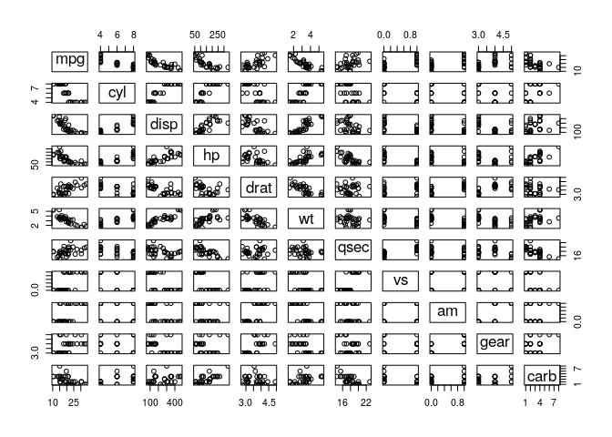

    ## ── Attaching packages ───────────────────────────────────────────────────────────────────── tidyverse 1.2.1 ──

    ## ✔ ggplot2 3.2.0     ✔ purrr   0.3.2
    ## ✔ tibble  2.1.3     ✔ dplyr   0.8.1
    ## ✔ tidyr   0.8.3     ✔ stringr 1.4.0
    ## ✔ readr   1.3.1     ✔ forcats 0.4.0

    ## ── Conflicts ──────────────────────────────────────────────────────────────────────── tidyverse_conflicts() ──
    ## ✖ dplyr::filter() masks stats::filter()
    ## ✖ dplyr::lag()    masks stats::lag()

# Dataset: 2019 Argentine General Election

The resulting dataset is availabel in `csv` (for excel) and `RDS` (for
R) formats:

  - `arg_elec_censo_wide.csv`
  - `arg_elec_censo_wide.RDS`

This project aims to create a dataset combining census statistics and
electoral results. These are the data sources combined:

  - 2010 **census** statistics
  - 2019 **PASO** presidential election
  - 2015 **PASO** presidential election
  - 2015 **presidential** election

Data is aggregated at “circuito”, the lowest level at which electoral
results are available. In Argentina, census and electoral geography are
independent so I had to create a lookup file for correspondences between
census tracks and electoral “circuitos”. I did this by computing the
area intersected between both set of boundaries.

## The dataset

``` r
plot(mtcars)
```

<!-- -->

### Variables

## How it was built
